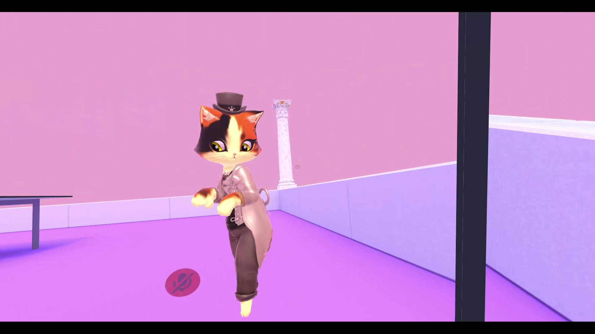

# Head Turn
MelonLoader mod for VRChat that allows to turn head regardless of body rotation. Slightly similar to ChilloutVR head turning.

# Installation
* Install [MelonLoader 0.3.0-ALPHA](https://github.com/LavaGang/MelonLoader).
* Get [latest release DLL](../../releases/latest).
* Put `ml_ht.dll` in `Mods` folder of game.

# Usage
* Hold `left alt` to lock body rotation.
  * Use `mouse wheel` to roll your head.
  * Hold `left control` to remove rotation limits.

# Notes
Usage of mods breaks ToS of VRChat and can lead to ban. Use at your own risk.
